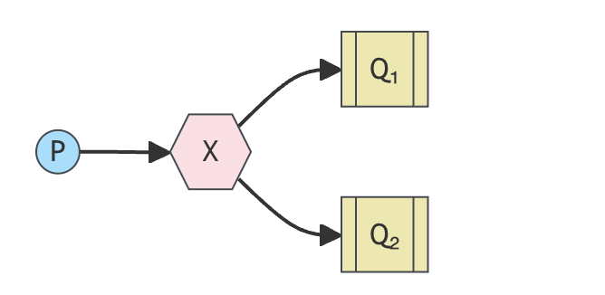
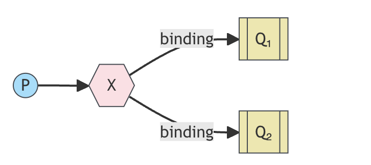
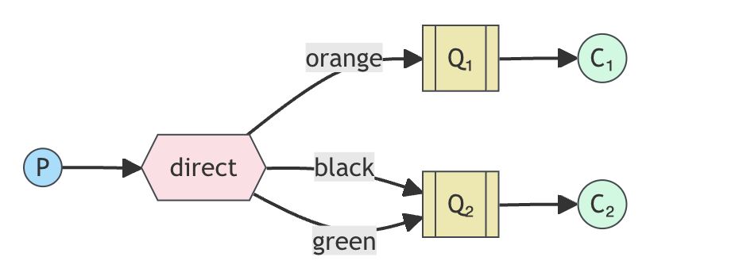
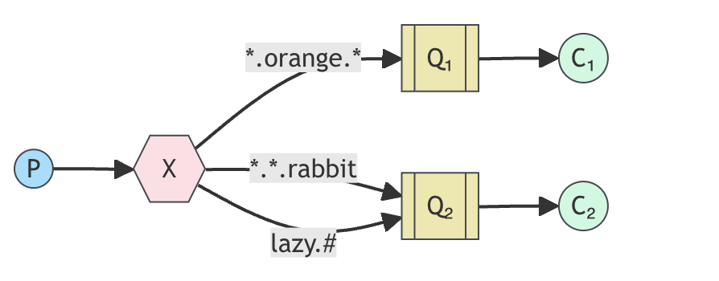
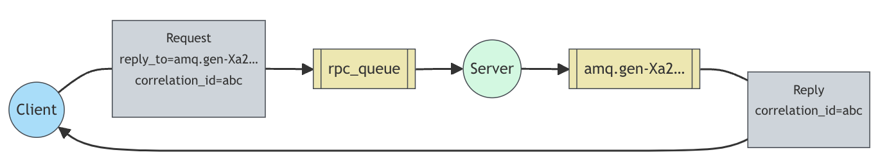

# RabbitMQ 3.13 

Language: Python

RabbitMQ libraries: pika

## Installing RabbitMQ

### Docker

`docker run -it --rm --name rabbbitmq -p 5672:5672 -p 15672:15672 rabbitmq:3.13-management`


## Part I: Hello World

### Introduction

RabbitMQ is a message broker: it accept and forwards messages.

RabbitMq, and messaging in general, uses somoe jargon.

- Producing means nothing more than sending. A program that sends messages is a producer.
- A queue is the name for the post box in RabbitMQ. Although messages flow through RabbitMQ and your applications, they can only be stored inside a queue. A queue is only bound by the host's memory & disk limits, it's essentially a large mesage buffer.
- Consuming has a similar meaning to receiving. A consumer is a program that mostly waits to receive messages.

Note that producer, consumer, and broker do not have to reside on the same host; indeed in most applications they don't An application can be both a producer and consumer, too.

Overall design will look like:


### Code

Send: [click](./part_1/sender.py)

Receive: [click](./part_1/receive.py)


## Part II: Work Queues

### Introduction

#### Main Idea

Work Queue that will be used to **distribute** time-consuming tasks among multiple workers.

The main idea behind **Work Queues**(aka: Task Queues) is to avoid doing a resource-intensive task immediately and having to wait for it to complete. Instead we schedule the task to be done later. We encapsulate a task as a message and send it to the queue. A worker process running in the background will pop the tasks and eventually execute the job. When you run many workers the tasks will be shared between them.

Overall design will look like:


### Dispatching 

#### Round-robin dispatching

One of the advantages of using a Task Queue is the ability to easily **parallelise work**. If we are building up a backlog of work, we can just add more workers and that way, **scale easily**.

By default, RabbitMQ will send each message to the next consumer, in sequence. On average every consumer will get the same number of messages. This way of distributing message called **round-robin**.


#### Fair dispatch

You might have noticed that the dispatching still doesn't work exactly as we want. For example in a situation with two workers, when all odd messages are havey and even messages are light, one worker will be constantly busy and the other one will do hardly any work. **Well, RabbitMQ doesn't know anything about that and will still dispatch messages evenly**.

This happends because RabbitMQ just dipatches a message when the message enters the queue. It doesn't look at the number of unacknowledged messages for a consumer. **It just blindly dispatches every n-th message to the n-th consumer.**


In order to defeat that we can use the `Channedl#basic_qos` channel method with the `prefetch_count=1` setting. This uses the `basic.qos` protocol method to tell RabbitMQ not to give more than one message to a worker at a time. Or, in other words, **don't dispatch a new message to a worker until it has processed and acknowledged the previous one**. Instead, it will dispatch it to the next worker that is not still busy.

`channel.basic_qos(prefetch_count=1)`


### Message acknowledgment

The omitted code is shown in Part I
```python
# new_task.py/sender.py

import sys

message = ' '.join(sys.argv[1:]) or "Hello World!"
channel.basic_publish(exchange='',
    routing_key='hello',
    body=message)
```

```python
# worker.py/receive.py

import time

def callback(ch, method, properties, body):
    print(f" [x] Received {body.decode()}") 
    time.sleep(body.count('.'))
    print(" [x] Done")
```

Doing a task can take a few seconds. you may wonder what happens if a counsumer starts a long task and it **terminates** before it completes. With our current code  once RabbitMQ delivers message to the consumer, it immediately marks it for deletion, In this case, if you terminate a worker, the message it was just processing is lost. The messages that were dispatched to this particular worker but were not yet handled are also lost.

But we don'st want to lose any tasks, if a worker dies, we'd like the task to be delivered to another worker.

In order to make sure a message is never lost, RabbitMQ supports message acknowledgmetns. *An ack is sent back by the consumer to tell RabbitMQ that a particular message had been received, processed and the RabbitMQ is free to delete it*. more Information [click](https://www.rabbitmq.com/docs/confirms)

If a consumer dies (its channel is closed, connection is closed, or TCP connection is lost) **without sending an ack**, RabbitMQ will understand that a message wasn't processed fully and will re-queue it. if there are other consumers online at the same time, it will then quickly redeliver it to **another consumer**.

**Manual message acknowledgement are turned on by default**. In previous example we explicitly turned them off via the `auto_ack=True` flag. It's time to remove this flag and send a proper acknowledgment from the worker, **once we're done with a task**.

```python
def callback(ch, method, properties, body):
    print(f" [x] Received {body.decode()}")
    time.sleep(body.count('.'))
    print(" [x] Done.)
    ch.basic_ack(delivery_tag = method.delivery_tag)

channel.basic_consume(queue='hello', on_message_callback=callback)
```

Acknowlefgement must be sent on the same channel that received the delivery. Attempts to acknowledge using a different channel will result in a channle-level protocol exception. See the [doc guide on confimations](https://www.rabbitmq.com/docs/confirms) to learn more.


### Message durability

We have learned how to make sure that even if the consumer dies, the task isn't lost. But our tasks will **still be lost if RabbitMQ server stops**.

When RabbitMQ quits or crashes it will forget the queue and messages unless you tell it not to. Two things are **required to make sure that messages aren't lost: we need to mark both the queue and messages as durable**.

First, we need to make sure that the queue will survive a RabbitMQ node restart. In order to do so. we need to decalare it as durable:

```python
channel.queue_declare(queue='hello', durable=True)
```

Although this command is correct by itself,  **it won't work in our setup**. That's becaues we've already defined a queue called `hello` which is not durable. RabbitMQ doesn't allow you to **redefine** an existing queue with different parameters and wiil return an error to any program that tries to do that. But there is a quick workaround - let's declare a queue with different name.

This `queue_declare` change needs to be applied to **both the producer and consumer code**.

At the point we're sure that queue won't be lost even if RabbitMQ restarts. Now we need to mark our message persistent - by supplying a `delivery_mode` property with the value of `pika.DeliveryMode.Persistent`

```python
channel.basic_publish(exchange='',
    routing_key="task_queu",
    body=message,
    properties=pika.BasicProperties(
        delivery_mode = pika.DeliveryMode.Persistent
    ))
```

> **Note on message persistence**
> Makeing messages as persistent doesn't **full guarantee** that message won't be lost. Although it tells RabbitMQ to save the message to disk, there is still a short time window when RabbitMQ has accepted a message and hasn't saved it yet. Also, RabbitMQ doesn't do `fsync(2)` for every message -- **it may be just saved to change and not really written to the disk**. The presistence guarantees aren't strong, but it's more enough for our simple task queue. If you need a stronger guarantee then you can use [publisher confirms](https://www.rabbitmq.com/docs/confirms)


### Code

new_task: [click](./part_2/new_task.py)

worker: [click](./part_2/worker.py)

## Part III: Publish/Subscribe

### Introduction

In this part we'll do somethin completely different -- we'll deliver a message to **multiple consumers**. This pattern is known ad "publish/subscirbe"

### Exchanges

Let's quickly go over what we covered in the previous tutorials

- A producer is a user application that sends messages.
- A queue is a buffer that stores meessage.
- A consumer is a user application that receives messages.

The core idea in the **messaging model in RabbitMQ** is that the producer never sends any messages directly to a queue. Actually, quite often the producer doesn't even know if a message will be delivered to any queue at all.

Instead, the producer can only send messages to an **exchange**. An exchange is a very simple thing. On ones side it receives messages from producers and on the other side it pushes them to queues. The exchange must know exactly what to do with a message it receives. 

- Should it be appended to a particular queue
- Should it be appended to many queues?
- Should ti get discarded

The rules for that are defined by teh exchange type.



There are a few exchange types available: 

- direct: A message goes to the queues whose `binding key` exactly matches the `routing key` of the message.
- topic: When a queue is bound with `#`(hash) binding key - it will receive all the messages, regardless of the routing key - like in `fanout` exchange. When special characters `*`(star) and `#`(hash) aren't used in bindings, the **topic exchange will behave just like `direct` one**.
- headers:
- fanout: It just broadcasts all the messages it receives to all the queue it knows.

### Teamporary queues

Being able to name a queue was **crucial** for us - we need to point the workers to the same queue. Giving a queue a name is important when you want to **share** the queue between producers and consumers.

But that's not the case of for our examples. We want to hear about all log messages, not just a **subset** of them. We're also interestead only in currently flowing messages not in the old ones. To solve that we need two things.

Firstly, whenever we connect to Rabbit we need a **fresh**, **empty** queue. To do it we could create a queue with a random name, or, even better - let the server choose a random queue name for us. We can do this by **supplying empty** `queue` parameter to `queue_declare`

Secondly, once the consumer connection is closed, the queue should be deleted. There's an `exclusive` flag for that

`result = channel.queue_declare(queue='', exclusive=True)`

You want to lean more about the `exclusive` flag and other queue properties in the [guide on queues](https://www.rabbitmq.com/docs/queues).

### Bindings



We've already created a fanout exchange and a queue. Now we need to tell the exchange to send messages to our queue. That **relationship** betweent exchange and a queue is called a binding.

### Direct exchange

we will use a `direct` exchange instead. The routing algorithm behind a `direct` exchange is simple - a message goes to the queue whose `binding key` exactly matches the `routing key` of the message.

### Code

emit_log: [click](./part_3/emit_log.py)

receive_logs: [click](./part_3/receive_logs.py)


## Part IV: Routing

### Introduction

we're going to make it possible to subscribe only to a **subset** of the messages. For example, we will be able to direct only critical error messages to the log file, while still being able to print all of the log messages on the console.

### Bindings

**A binding is a relationship between an exchange and a queue**. This can be simply read as: the queue is **interested** in messages from this exchange.

Bindings can take an extra `routing_key` parameter. To avoid the confusion with a `basic_publish` parameter we're going to call it a `binding_key`.

To illustrate that, consider the following setup:



In this setup, we can see the `direct` exchange `X` with two queues bound to it. The first queue is bound with binding key `orange`, and the second has two bindings, one with binding key `black` and the other one with `green`.

In such a setup a message published to the exchange with routing key `orange` will be routed to queue `Q1`. Messages with a routing key of `black` or `green` will go to `Q2`. All other messages will **be dicarded**.

### Multiple bindings

**It is perfectly legal to bind multiple queue will the same binding key**. In our example we could add a binding between `X` and `Q1` with binding key `black`. In this case, the `direct` exchange will behave like `fanout` and will **broadcast** the message to **all the matching** queues. A message with routing key `black` will be delivered to both `Q1` and `Q2`.


### Code

emit_log_direct: [click](./part_4/emit_log_direct.py)

receive_logs_direct: [click](./part_4/receive_logs_direct.py)

## Part V: Topics

### Introduction

In our logging system we might want to subscribe to not only logs based on severity. but also based on the **source** which emitted the log. You might know this concept from the `syslog` unix tool, which logs based on both severity (info/warn/crit...) and **facility**(auth/cron/kern...).

That would give us a lot of flexibility - we may want to listen to just critical errors coming from 'cron' but also all logs from 'kern'.

To implement that in our logging system we need to lean about more complex `topic` exchange.

### Topic exchange

Messages sent to a `topic` exchange can't have an arbitrary `routing_key` - it **must** be a list of words, delimited by dots. The words can be anything, but usually they specify some features connected to the message. A few valid routing key example: "`stock.usd.nyse`", "`nyse.vmw`", "`quick.orange.rabbit`". There can be as many words in the routing key as you like, up to the **limit of 255 bytes**.

The binding key must also be in the same form. The logic behind the `topic` exchange is similar to a `direct` one - a message sent with a prticular routing key will be delivered to all the queues that are bound with a matching binding key. Howere there are two important special case for binding keys:

- `*`(star) can substitute for exactly one word.
- `#`(hash) can substitute for zero or more words.

It's easiest to explain this in an example:



In this example, we're going to send messages which all describe animals. The messages will be sent with a routing key that consists of **tree words**(two dots). The first word in the routing key will describe aa celerity, second a colour and third a species: 
`<celerity>.<colour>.<species>`

We created three bindings: Q1 is bound with binding key "`*.orange.*`" and Q2 with "`*.*.rabbit`" and "`lazy.#`"

These bindings can be summarised as:
- Q1 is interested in all the **orange** animals.
- Q2 wants to hear everything about **rabbit**, and everything about **lazy** animals.

What happens if we **break** out contract and send a message with one or four words. like `orange` or `quick.orange.new.rabbit`? Well, these messages won't match any bindings and will be lost.

On the other hand `lazy.orange.new.rabbit`, even though it has four words, will match the last binding and will be delivered to the second queue.


### Code

emit_log_topic: [click](./part_5/emit_log_topic.py)

receive_logs_topic: [click](./part_5/receive_logs_topic.py)

## Part VI: RPC

### Introduction

What if we need to run a function on a remote computer and wait for the result? Well, that's a different story. This pattern is commonly known as **Remote Procedure Call or RPC**.

In this tutorial we're going to use RabbitMQ to build an RPC system: a client and a scalable RPC server. We're going to create a dummy RPC service that returns Fibonacci numbers.

### Client interface

To illustrate how an RPC service could be used we're going to create a simple client class. It's going to expose a method named `call` which sends an RPC request and **blocks** untill the answer is received.

```Python
fibonacci_rpc = FibonacciRpcClient()
result = fibonacci_rpc.call(4)
print(f"fib(4) is {result}")
```

### Callback queue

In general doing RPC over RabbitMQ is easy. A client sends a request message and a server replies with a response message. In order to receive a response the client needs to send a 'callback' queue address with the request. Let's try it.

```Python
result = channel.queue_declare(queue='', exclusive=True)
callback_queue = result.method.queue

channel.basic_publish(exchange='',
    routing_key='rpc_queue',
    properties=pika.BasicProperties(
        reply_to = callback_queue,
    ),
    body=request)
```

### Correlation id

In the method presented above we suggest creating a callback queue for every RPC request. That's pretty inefficient, but fortunately there is a better way - let's create a single callback queue per client.

That raise a new issue, having received a reponse in that queue it's not clear to which request the response belongs. That's when the `correlation_id` property is used. We're going to set it to a unique value for every request. Later, when we receive a message in the callback queue we'll look at this property, and based on that we'll be able to match a response with a request. If we see unkonwn `correlation_id` value. we may safely discard the message - it doesn't belong to our requests.

why should we **ignore** unknown messages in the callback queue, rather than failing with an error? it's due to a possibility of a **race condition** on the server side. Although unlikely, it is possible that the RPC server will die just after sending us the answer, but before sending an acknowledgment message for the request. If that happens, the **restarted RPC server will process the request again**. That's why on the client we must handle the **duplicate response gracefully**, and the RPC should ideally be idempotent.

### Summary



Our RPC will work like this:

- When the Client start up, it creates an **anonymous exclusive** callback queue.
- For an RPC request, the Client sends a message with two properties: `reply_to`, which is set to the callback queue and `correlation_id`, which is set to a unique value for every request.
- The request is sent to an `rpc_queue` queue.
- The RPC worker(aka: server) is waiting for requests on that queue. When a request appears, it does the job and sends a message with the result back to the Client, using the queue from the `reply_to` field.
- The client waits for data on the callback queue. When a message appears, it checks the `correlation_id` property. If it matches the value from the request it returns the response to the application.


### Code

rpc_server: [click](./part_6/rpc_server.py)

rpc_client: [click](./part_6/rpc_client.py)

## References

RabbitMQ tutorial: https://www.rabbitmq.com/tutorials/tutorial-one-python

