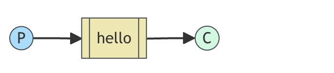
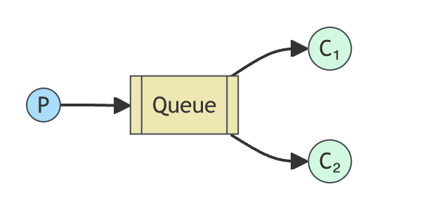
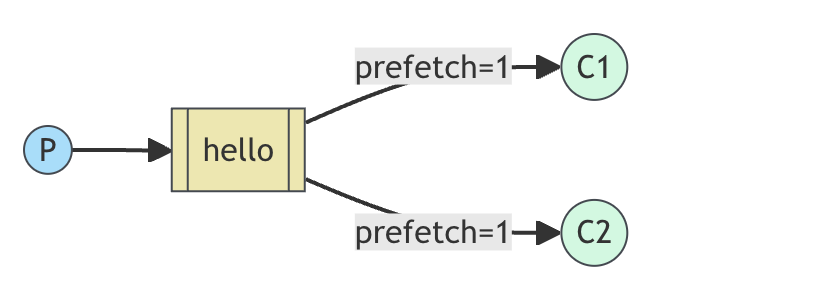

# RabbitMQ 3.13 

Language: Python
RabbitMQ libraries: pika

## Installing RabbitMQ

### Docker

`docker run -it --rm --name rabbbitmq -p 5672:5672 -p 15672:15672 rabbitmq:3.13-management`


## Part I: Hello World

### Introduction

RabbitMQ is a message broker: it accept and forwards messages.

RabbitMq, and messaging in general, uses somoe jargon.

- Producing means nothing more than sending. A program that sends messages is a producer.
- A queue is the name for the post box in RabbitMQ. Although messages flow through RabbitMQ and your applications, they can only be stored inside a queue. A queue is only bound by the host's memory & disk limits, it's essentially a large mesage buffer.
- Consuming has a similar meaning to receiving. A consumer is a program that mostly waits to receive messages.

Note that producer, consumer, and broker do not have to reside on the same host; indeed in most applications they don't An application can be both a producer and consumer, too.

Overall design will look like:




### Code

Send: [click](./part_1/sender.py)
Receive: [click](./part_1/receive.py)

## Part II: Work Queues

### Introduction

#### Main Idea

Work Queue that will be used to **distribute** time-consuming tasks among multiple workers.

The main idea behind **Work Queues**(aka: Task Queues) is to avoid doing a resource-intensive task immediately and having to wait for it to complete. Instead we schedule the task to be done later. We encapsulate a task as a message and send it to the queue. A worker process running in the background will pop the tasks and eventually execute the job. When you run many workers the tasks will be shared between them.

Overall design will look like:



### Dispatching 

#### Round-robin dispatching

One of the advantages of using a Task Queue is the ability to easily **parallelise work**. If we are building up a backlog of work, we can just add more workers and that way, **scale easily**.

By default, RabbitMQ will send each message to the next consumer, in sequence. On average every consumer will get the same number of messages. This way of distributing message called **round-robin**.

#### Fair dispatch

You might have noticed that the dispatching still doesn't work exactly as we want. For example in a situation with two workers, when all odd messages are havey and even messages are light, one worker will be constantly busy and the other one will do hardly any work. **Well, RabbitMQ doesn't know anything about that and will still dispatch messages evenly**.

This happends because RabbitMQ just dipatches a message when the message enters the queue. It doesn't look at the number of unacknowledged messages for a consumer. **It just blindly dispatches every n-th message to the n-th consumer.**



In order to defeat that we can use the `Channedl#basic_qos` channel method with the `prefetch_count=1` setting. This uses the `basic.qos` protocol method to tell RabbitMQ not to give more than one message to a worker at a time. Or, in other words, **don't dispatch a new message to a worker until it has processed and acknowledged the previous one**. Instead, it will dispatch it to the next worker that is not still busy.

`channel.basic_qos(prefetch_count=1)`


### Message acknowledgment

The omitted code is shown in Part I
```python
# new_task.py/sender.py

import sys

message = ' '.join(sys.argv[1:]) or "Hello World!"
channel.basic_publish(exchange='',
    routing_key='hello',
    body=message)
```

```python
# worker.py/receive.py

import time

def callback(ch, method, properties, body):
    print(f" [x] Received {body.decode()}") 
    time.sleep(body.count('.'))
    print(" [x] Done")
```

Doing a task can take a few seconds. you may wonder what happens if a counsumer starts a long task and it **terminates** before it completes. With our current code  once RabbitMQ delivers message to the consumer, it immediately marks it for deletion, In this case, if you terminate a worker, the message it was just processing is lost. The messages that were dispatched to this particular worker but were not yet handled are also lost.

But we don'st want to lose any tasks, if a worker dies, we'd like the task to be delivered to another worker.

In order to make sure a message is never lost, RabbitMQ supports message acknowledgmetns. *An ack is sent back by the consumer to tell RabbitMQ that a particular message had been received, processed and the RabbitMQ is free to delete it*. more Information [click](https://www.rabbitmq.com/docs/confirms)

If a consumer dies (its channel is closed, connection is closed, or TCP connection is lost) **without sending an ack**, RabbitMQ will understand that a message wasn't processed fully and will re-queue it. if there are other consumers online at the same time, it will then quickly redeliver it to **another consumer**.

**Manual message acknowledgement are turned on by default**. In previous example we explicitly turned them off via the `auto_ack=True` flag. It's time to remove this flag and send a proper acknowledgment from the worker, **once we're done with a task**.

```python
def callback(ch, method, properties, body):
    print(f" [x] Received {body.decode()}")
    time.sleep(body.count('.'))
    print(" [x] Done.)
    ch.basic_ack(delivery_tag = method.delivery_tag)

channel.basic_consume(queue='hello', on_message_callback=callback)
```

Acknowlefgement must be sent on the same channel that received the delivery. Attempts to acknowledge using a different channel will result in a channle-level protocol exception. See the [doc guide on confimations](https://www.rabbitmq.com/docs/confirms) to learn more.

### Message durability

We have learned how to make sure that even if the consumer dies, the task isn't lost. But our tasks will **still be lost if RabbitMQ server stops**.

When RabbitMQ quits or crashes it will forget the queue and messages unless you tell it not to. Two things are **required to make sure that messages aren't lost: we need to mark both the queue and messages as durable**.

First, we need to make sure that the queue will survive a RabbitMQ node restart. In order to do so. we need to decalare it as durable:

```python
channel.queue_declare(queue='hello', durable=True)
```

Although this command is correct by itself,  **it won't work in our setup**. That's becaues we've already defined a queue called `hello` which is not durable. RabbitMQ doesn't allow you to **redefine** an existing queue with different parameters and wiil return an error to any program that tries to do that. But there is a quick workaround - let's declare a queue with different name.

This `queue_declare` change needs to be applied to **both the producer and consumer code**.

At the point we're sure that queue won't be lost even if RabbitMQ restarts. Now we need to mark our message persistent - by supplying a `delivery_mode` property with the value of `pika.DeliveryMode.Persistent`

```python
channel.basic_publish(exchange='',
    routing_key="task_queu",
    body=message,
    properties=pika.BasicProperties(
        delivery_mode = pika.DeliveryMode.Persistent
    ))
```

> **Note on message persistence**
> Makeing messages as persistent doesn't **full guarantee** that message won't be lost. Although it tells RabbitMQ to save the message to disk, there is still a short time window when RabbitMQ has accepted a message and hasn't saved it yet. Also, RabbitMQ doesn't do `fsync(2)` for every message -- **it may be just saved to change and not really written to the disk**. The presistence guarantees aren't strong, but it's more enough for our simple task queue. If you need a stronger guarantee then you can use [publisher confirms](https://www.rabbitmq.com/docs/confirms)


### Code

new_task: [click](./part_2/new_task.py)
worker: [click](./part_2/worker.py)


## References

RabbitMQ 3.13 Documentation:https://www.rabbitmq.com/docs